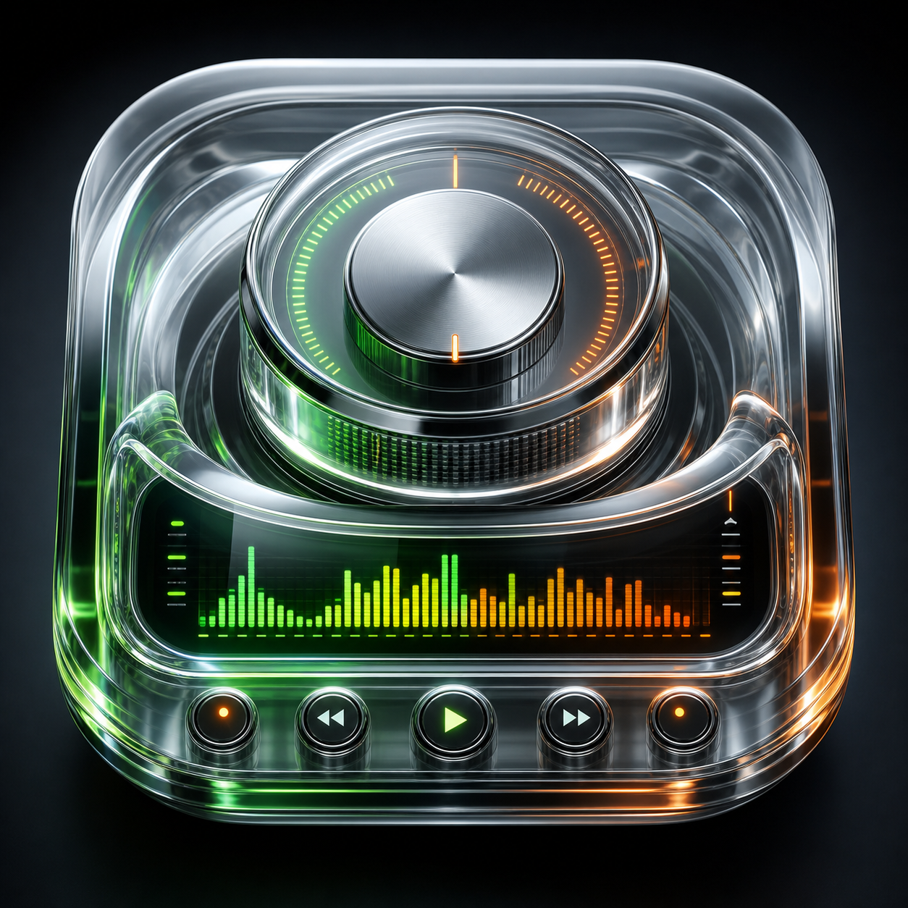
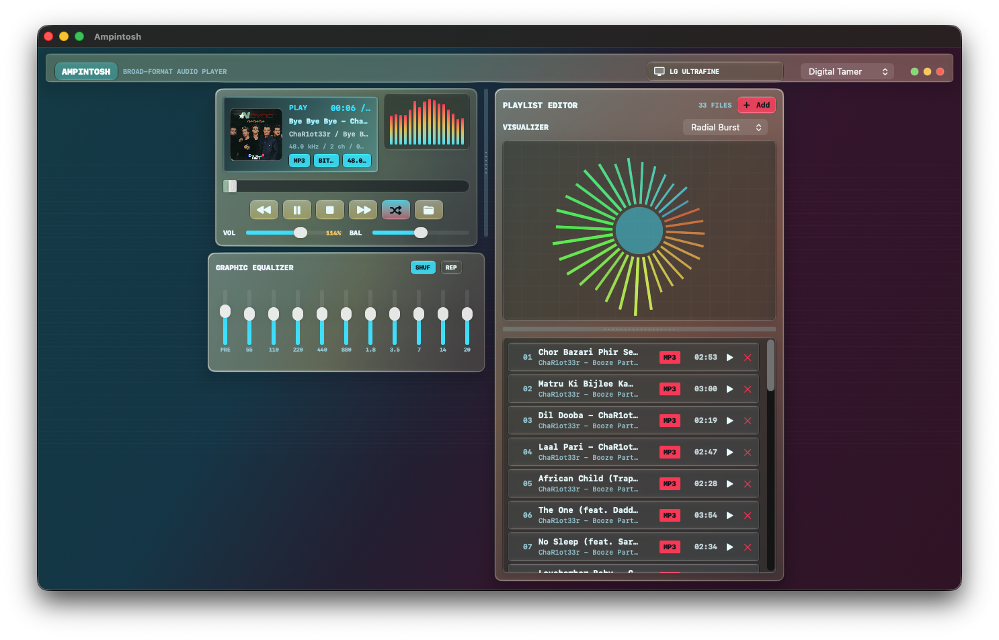

# Ampintosh

  

Ampintosh is a macOS music player that blends compact Winamp-style controls with a modern Liquid Glass interface. It is built in SwiftUI and focuses on local audio playback, rich file inspection, configurable skins, and animated visualizers.

## Features

- Local audio playback with playlist management, title sorting, and missing-file cleanup
- Broad file picker support for common and enthusiast audio formats
- Direct M3U and M3U8 playlist import with relative-path resolution
- Volume control up to 200% for extra software amplification headroom
- Metadata display for title, artist, album, artwork, bit depth, sample rate, channels, bitrate, and codec when available
- Album art display with a graceful fallback
- Output device indicator with contextual glyphs for AirPods, headphones, displays, speakers, soundbars, and Bluetooth output
- Real stereo balance control
- Resizable playlist and visualizer panes
- Twelve audio-reactive visualizers driven by a live FFT, so they respond to both frequency content and amplitude: Spectrum, Mirror Bars, Oscilloscope, Fractal, Orbit, Rings, Tunnel, Radial Burst, Lissajous, Bloom, Particles, and Spectro Fall
- Remembers the last skin (and visualizer) you used and restores it on the next launch
- Multiple inspired skins:
  - Ampintosh
  - Fruit Studio 12
  - Live Session
  - Orange Black
  - Digital Tamer
  - OctoHub
  - Space Cowboy
  - Music Glass
- Last.fm integration

## Screenshots

## Building

Open the project in Xcode and build the `Ampintosh` target. The debug app bundle is produced by Xcode in DerivedData, and this workspace also uses a local `Build/Ampintosh.app` copy for easy Finder testing.

## Nintendo Switch version
A Nintendo Switch version can be found on the [Releases](https://github.com/KiwiSingh/Ampintosh/releases) page. It includes solid features such as async streaming from SMB and SSH shares, USB support (untested!), Last.fm integration (via the `ampintosh.ini` file), audio visualizers, and skins. Go check it out now!

## Notes

Technical metadata is read through AVFoundation, so availability depends on what macOS can decode and what each file exposes in its container metadata.

Playback runs on an `AVAudioEngine` graph (player node → EQ headroom node → main mixer), with a tap feeding a real Accelerate/vDSP FFT. That FFT produces the per-band frequency magnitudes, RMS loudness, transient peak, and waveform that drive every visualizer, so the visuals track the actual music rather than a synthesized animation. The EQ node also provides the true amplification used for volume above 100%.
